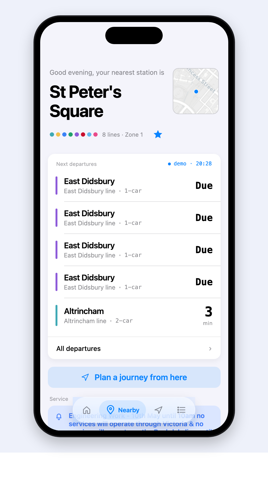

# EasyMet

A companion app for the **Manchester Metrolink** tram network. Live departures, journey planning, service alerts, and a step-by-step on-trip view — built around the stations you actually use.

Real TfGM data, real routing across all 8 corridors, all 99 stations. iOS 26 "Liquid Glass" floating tab bar. Hand-rolled soft-UI component kit.

## Screenshots

<p align="center">
  
  
  
</p>
<p align="center">
  
  
  
</p>
<p align="center">
  
  
</p>

## Tech

- **React Native 0.81** + **React 19** on **Expo SDK 54** (Expo Router, Image, Haptics, Location, Linear Gradient, Live Activities)
- **TypeScript** end-to-end
- **TfGM Developer API** for live data (Metrolinks endpoint + Travel Alerts)
- **Storybook for React Vite** running on top of `react-native-web` for the component library
- **Vitest** for unit tests, **Playwright** for end-to-end against the Expo Web build
- **Cloudflare Pages** for the web deploy

## Running it

```bash
npm install
npm run ios          # iOS simulator
npm run android      # Android emulator
npm run web          # Expo Web dev server
npm run storybook    # Component library — http://localhost:6006
```
