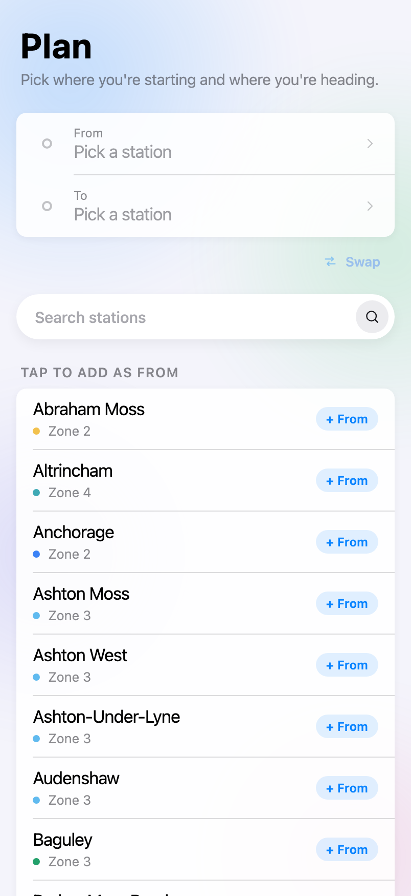
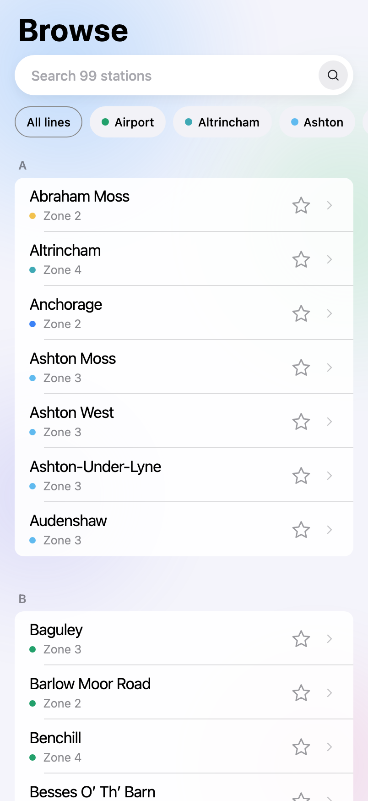
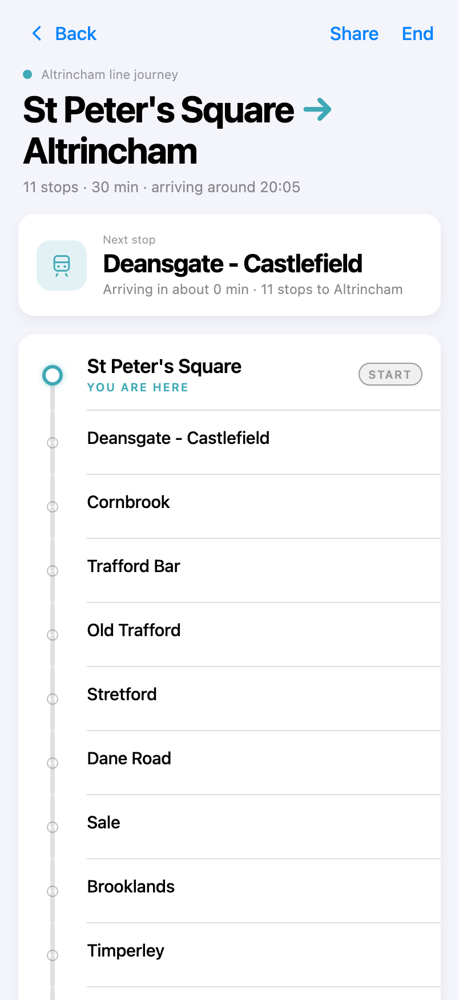
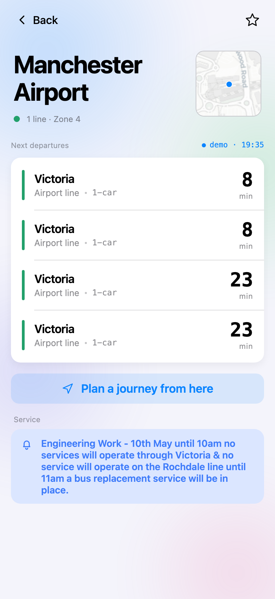
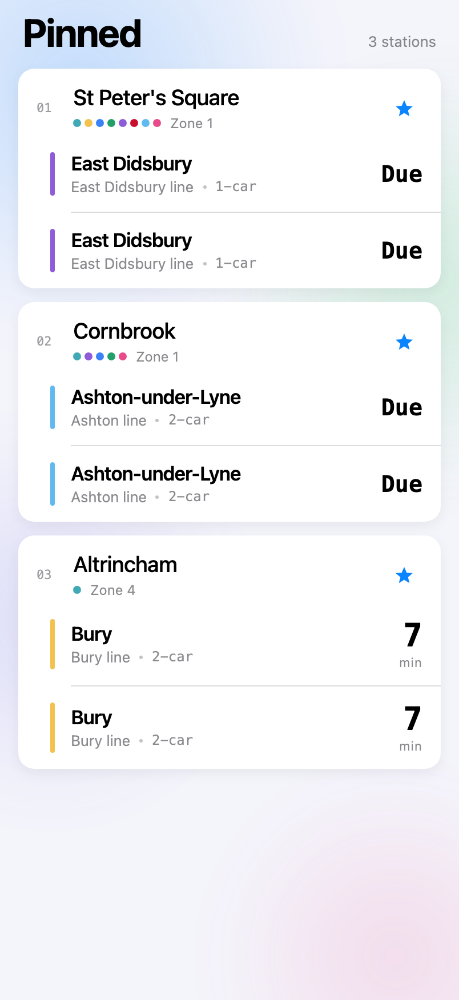

# EasyMet

A companion app for the **Manchester Metrolink** tram network — live departures, journey planning, service alerts, and a step-by-step on-trip view. Built in React Native + Expo, with a hand-rolled soft-UI component library and live data from the [TfGM developer API](https://developer.tfgm.com/).

> Side project. Real data, real stations (all 99 stops, all 8 corridors), real routing.

---

## Highlights

- **Live departures** for every Metrolink stop, refreshed via the TfGM Metrolinks endpoint.
- **Journey planner** with single-line routing across the 8 corridors, step-by-step "you are here" tracking, and a share affordance for sending an ETA to a friend.
- **Service alerts & disruptions** sourced from `/disruptions`, grouped by severity (severe / notice / info) and time horizon (active now / coming up).
- **Pinned stations** for one-tap access to your daily stops, with grouped iOS-style cards.
- **Soft-UI design kit** built from scratch — 27 atoms (Button, TextField, SoftCard, SoftModal, SegmentedControl, Stepper, Slider, DatePicker, …) with consistent press feedback, mobile-safe touch targets, and a tone-based colour system.
- **Storybook** covers every atom plus every app page, so the design system can be browsed independently of the app.

---

## Screenshots

| Home (empty state) | Plan a journey | Browse stations |
| :--: | :--: | :--: |
|  |  |  |

| Pinned · live departures | Journey · step-by-step | Station detail |
| :--: | :--: | :--: |
|  |  |  |

| Network announcements | Empty-state pattern |
| :--: | :--: |
|  |  |

---

## Tech stack

- **React Native 0.81** with **React 19**
- **Expo SDK 54** (Expo Router, Linking, Image, Haptics, Location, Linear Gradient, Live Activities module)
- **TypeScript** end-to-end
- **Storybook for React Vite** running on top of `react-native-web` for the component library
- **Playwright** + **Vitest** for end-to-end and unit testing
- **TfGM API** for live data (Metrolinks, disruptions, journey planning)
- **Cloudflare Pages** for the web build (`npm run deploy`)

---

## The soft-UI design system

The kit at `src/components/soft/` is the project's most opinionated piece — a pill-heavy aesthetic with white floating surfaces on a pale lavender canvas, low-spread drop shadows, tonal status colours, and saturated gradients reserved for AI / primary CTAs. Three tiers of atoms, each composing the foundation primitives:

| Tier | Atoms |
| :-- | :-- |
| Foundation | `SoftPill` · `SoftCard` · `SoftIcon` · `SoftMenu` · interaction primitives (`pressFeedback`, `minTouch`) · tone tokens |
| Tier 1 (every app needs them) | `Button` · `TextField` · `Switch` · `Checkbox` · `Radio` · `Avatar` · `SoftModal` (center + bottom sheet) · `SegmentedControl` |
| Tier 2 (async + feedback) | `Banner` · `Toast` (with `ToastProvider`/`useToast` hook) · `Skeleton` · `Spinner` · `Progress` · `EmptyState` · `ListRow` + `ListRowGroup` |
| Tier 3 (specialised) | `Tabs` · `Accordion` · `AvatarGroup` · `Slider` (PanResponder-based, no third-party dependency) · `DatePicker` (month-grid, single date) |
| EasyMet-specific gap-fillers | `BottomTabBar` · `Pill` (content pill) · `Refreshable` (themed pull-to-refresh) |

Every interactive atom uses:

- A shared `pressFeedback({ pressed })` style helper for a subtle scale + opacity dip.
- `minTouch` (44pt on native, 28pt on web) for hit-target sizing — small visible glyphs get an invisible Pressable wrapper sized to be thumb-safe.
- Soft tone semantics (`accent` / `success` / `warning` / `danger` / `neutral`) rather than ad-hoc colours.

A few highlights worth noting:

- **Stepper** renders compact stacked chevrons on web but bumps to two ≥44pt round buttons on native — same component, platform-appropriate layout.
- **SoftMenu** floats a popover anchored to its trigger, used by `ToolbarDropdown` and the picker sheets.
- **SoftModal** consolidates four hand-rolled bottom-sheet implementations (StationPicker, DestinationPicker, SwitchStation, TweaksPanel) into one chassis — ~430 LOC removed across the four files.

---

## Architecture

```
app/                       # Expo Router file-based routing
├── (tabs)/
│   ├── index.tsx          # Home — pinned stations, departures, network bell
│   ├── nearby.tsx         # Nearby — sorted by distance, with mini map
│   ├── plan.tsx           # Journey planner — From/To, route preview
│   ├── pinned.tsx         # Pinned — full-feature favourites view
│   └── browse.tsx         # All 99 stations, search + corridor filter
├── journey.tsx            # Active journey ladder, "you are here" tracking
├── announcements.tsx      # Disruption feed, dismissable
└── station/[code].tsx     # Station detail — departures, line strip, map

src/
├── components/            # App-specific components (DepartureRow, MiniMap, …)
│   └── soft/              # The soft-UI design system
├── lib/                   # Domain logic
│   ├── api.ts             # TfGM API client
│   ├── journey.ts         # Single-line routing + travel-time estimation
│   ├── lines.ts           # 8 Metrolink corridors with their colours
│   ├── stations.ts        # 99 stations, distance / search / lookup
│   ├── disruptions.ts     # Severity + time-horizon partitioning
│   └── *Context.tsx       # Tweaks, Demo mode, Favourites, Journey, …
├── data/                  # Bundled fixtures (stations, demo snapshot)
└── stories/               # Storybook page-level stories
```

The Soft-UI kit and the app are deliberately separable — `src/components/soft/` has no imports from the rest of `src/`, so it could be lifted into its own package.

---

## Running it

### Mobile

```bash
npm install
npm run ios          # or npm run android, npm run start
```

The default scenario is `live` — real TfGM fetches every 30s. Switch to the bundled `demo` snapshot via the dev `TweaksPanel` if you want offline-friendly data.

### Web

```bash
npm run web          # Expo Web dev server
npm run deploy       # Build + deploy to Cloudflare Pages
```

### Storybook

```bash
npm run storybook    # http://localhost:6006
```

The Storybook surface is divided into two top-level groups:

- **`Pages`** — every app screen wired up with real providers (`FavouritesProvider`, `JourneyProvider`, `DisruptionsProvider`, …), seeded with realistic data. Useful for visual QA without booting the simulator.
- **`Soft UI`** — every kit atom in isolation, plus four sample-pages (`Sign in`, `Discover`, `Settings`, `Profile`, `EasyMet account`) that compose the kit into full mobile layouts.

---

## Testing

```bash
npm run test         # Vitest unit tests
npm run test:e2e     # Playwright against the Expo web build
```

- **Unit tests** cover lookup tables, journey routing, disruption grouping, and the favourites context — anywhere the logic could silently rot without a test guarding it.
- **E2E tests** run against the Expo Web build at port `8081`, simulating an iPhone 14 viewport. Useful for catching layout regressions; not a substitute for real-device QA (haptics, native maps, blur, splash, gestures all behave differently on native).

---

## Notable engineering moments

- **Hook-order bug in `JourneyScreen`** — a `useCallback` declared after an early `return null` worked on first render but crashed once the journey arrived asynchronously. Fixed by hoisting all derived values + the callback above the early return; safe defaults handle the no-journey case. Found via a Storybook crash report.
- **Async-storage race in seeded Storybook stories** — seeding favourites in a `useEffect` raced the `AsyncStorage.getItem` load inside `FavouritesProvider`, which silently overwrote the seed. Fixed by gating the seeder on the context's `loaded` flag.
- **Vite + Expo native module incompatibility** — `expo-modules-core` imports `TurboModuleRegistry` from `react-native`, which `react-native-web` doesn't expose. Storybook's preview required Vite aliases that stub `expo-modules-core`, `expo-haptics`, `expo-location`, and `expo-linear-gradient` so the design-system stories can render on the web without hitting native bridges.
- **`@expo/vector-icons` is asset-heavy** for Vite. The soft kit ships its own SVG icon set (`SoftIcon`) with 40+ glyphs drawn as inline paths — no font loading, no asset plugins, and recolour just works.

---

## Roadmap

- Dark-mode tokens for the soft kit (light is the only theme today)
- Native module for the iOS Live Activity (see `modules/journey-activity/`)
- Push notifications for "tram approaching" + service alerts on selected corridors
- Test coverage for the soft kit atoms

---

## Credits

- **Live data**: [TfGM Developer API](https://developer.tfgm.com/) — Metrolinks endpoint, Travel Alerts feed.
- **Station geometry**: TfGM stops file, supplemented with Wikipedia (`scripts/stations-wikipedia.json`) for friendlier display names.
- **Design language**: Soft-UI exploration shaped from a community design-system inspiration, ported to React Native + Expo.

Built by [Callum Davies](mailto:dvscllm@gmail.com). The complete component library is browseable in Storybook — see `docs/screenshots/` for thumbnails of every screen.
