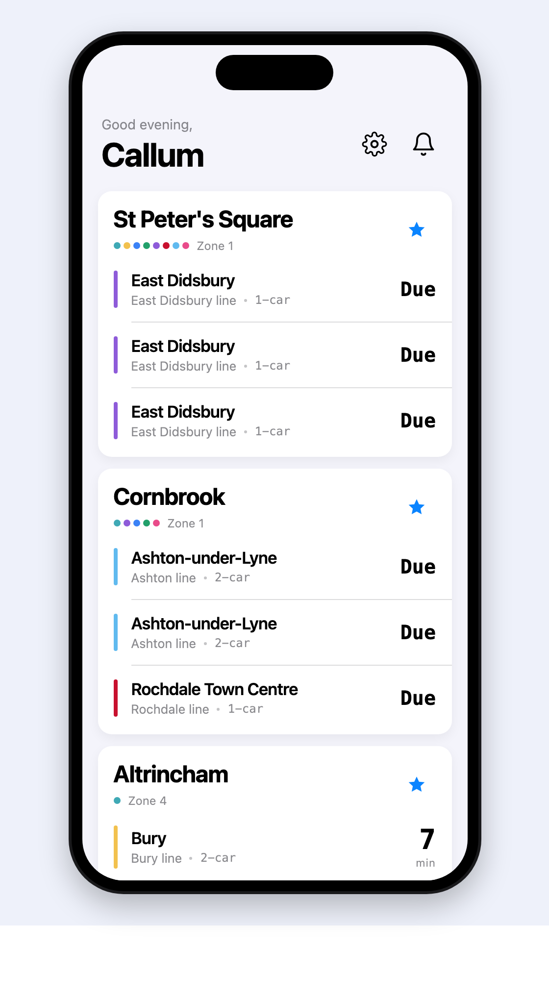
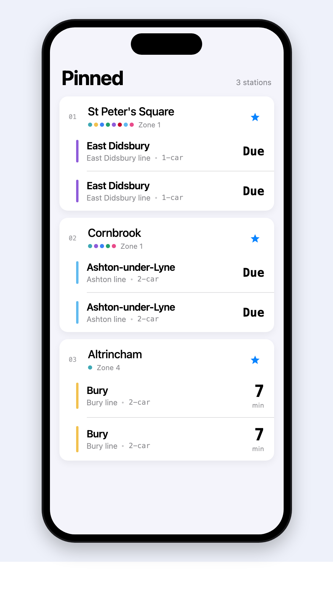
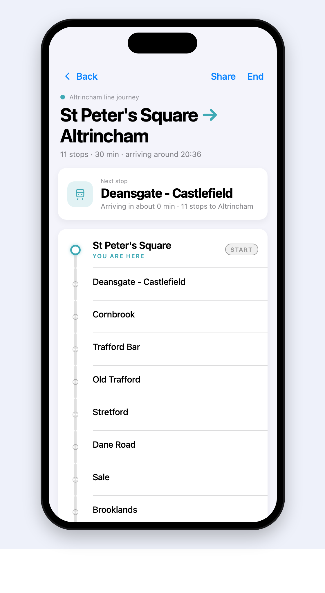
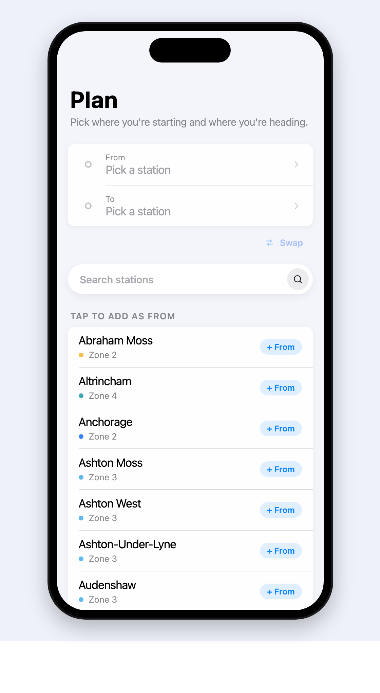
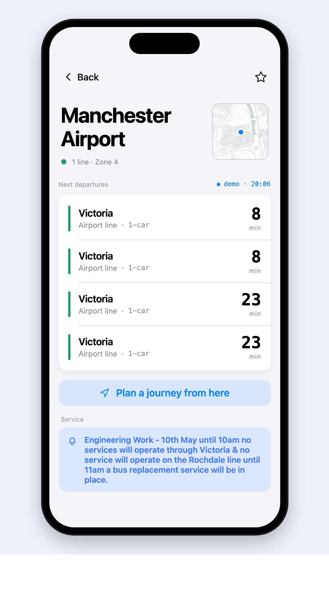
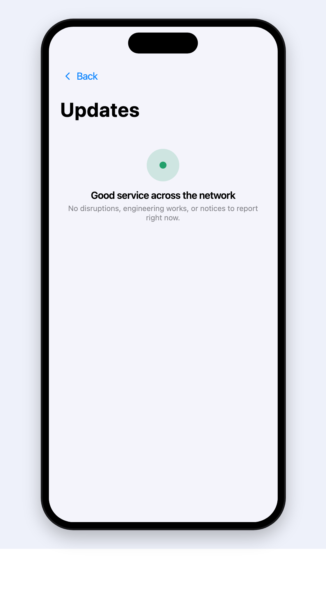
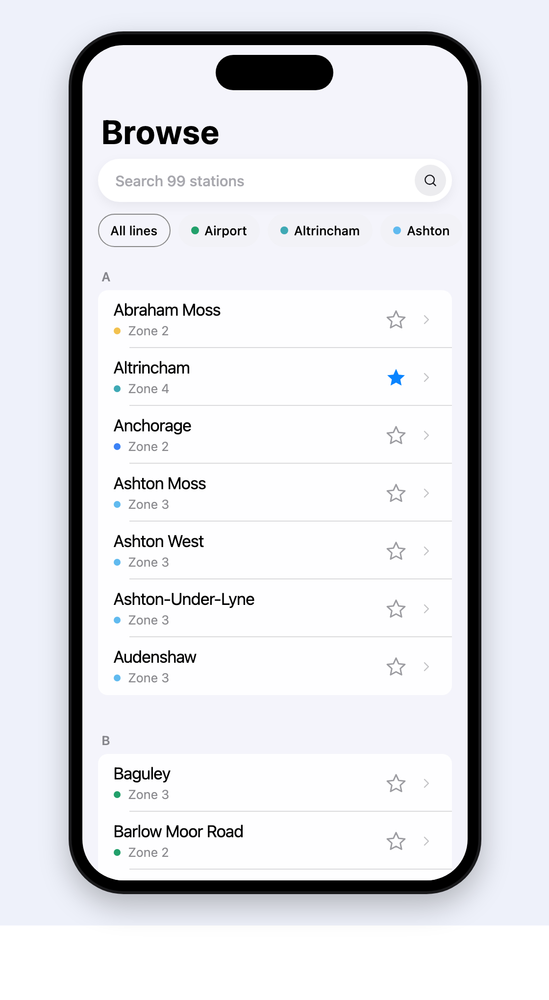

<div align="center">

# EasyMet

#### Manchester Metrolink — without the friction.

A companion app for the **Manchester Metrolink** tram network. Live departures, journey planning, service alerts, and a step-by-step on-trip view — all in one app, all built around the stations you actually use.

<br />



<br /><br />

</div>

---

### Pin the stations you live by.

EasyMet remembers your home, your work, the one near your gym — and shows their next departures the moment you open the app. No tabs, no searching. Just the trams you're about to get on.

<table align="center">
<tr>
<td width="50%" valign="top">

</td>
<td width="50%" valign="top">

**Live departures, every time you open it**

- Pin any of the 99 stations across the network
- Real-time data from the TfGM Metrolinks endpoint
- Line-coded indicators · 8 Metrolink corridors
- Pull-to-refresh, with an accent-coloured spinner that matches the app

</td>
</tr>
</table>

---

### Tell it where you're going. Stay on the rails.

The journey planner finds the single-line route between any two stations, then drops you into a step-by-step view that tracks where you are on the line. Share an ETA with a friend in one tap.

<table align="center">
<tr>
<td width="50%" valign="top">

**Routes across the whole network**

- Single-line routing across all 8 Metrolink corridors
- ETA computed live, with arrival time + minutes-to-go
- Mid-trip share affordance: sends a friendly "On my way to X, ETA 18:42" message via the OS share sheet
- A "Next stop" card stays pinned at the top while the ladder scrolls

</td>
<td width="50%" valign="top">

</td>
</tr>
<tr>
<td width="50%" valign="top">

</td>
<td width="50%" valign="top">

**From / To, that's it**

- Pick endpoints from a bottom-sheet search
- The whole network is browsable inline — every station, every zone, every line
- "Start journey · 30 min" CTA gives you the full picture before you commit

</td>
</tr>
</table>

---

### A station detail page that actually has detail.

<table align="center">
<tr>
<td width="50%" valign="top">

</td>
<td width="50%" valign="top">

**Departures, mini-map, and what's wrong today**

- Every line that calls at this stop, colour-coded
- A miniature map so you remember which Trafford Bar this is
- Service notices surface inline as a soft accent banner — no need to hunt through a separate alerts page

</td>
</tr>
</table>

---

### Service alerts that respect your time.

<table align="center">
<tr>
<td width="50%" valign="top">

**Tonal status, not red walls**

- Each disruption tagged by severity: severe · notice · info
- Dismiss the ones you've read; restore them if you change your mind
- "Coming up" planned works partitioned from "Active now" — no surprise tomorrow

</td>
<td width="50%" valign="top">

</td>
</tr>
</table>

---

### The whole network, browsable.

<table align="center">
<tr>
<td width="50%" valign="top">

</td>
<td width="50%" valign="top">

**99 stations, eight corridors, one screen**

- Real-time search across every station name
- Filter by corridor with a colour-coded chip strip
- Tap a star to pin; the row stays put while you do it

</td>
</tr>
</table>

---

## Built with

<table>
<tr>
<td>

**React Native 0.81** · React 19  
**Expo SDK 54** · Expo Router, Image, Haptics, Location, Linear Gradient, Live Activities  
**TypeScript** end-to-end  
**Storybook for React Vite** on top of react-native-web  
**Playwright** + **Vitest** for tests  
**Cloudflare Pages** for the web build

</td>
<td>

Data lives on the **TfGM Developer API** — Metrolinks (live tram positions) and Travel Alerts (disruptions). Station geometry comes from the TfGM stops file, supplemented with Wikipedia for friendlier display names.

The app ships with a hand-rolled **soft-UI component kit** at `src/components/soft/` — 27 atoms, three tiers, shared interaction primitives. See "Design system" below.

</td>
</tr>
</table>

---

## Design system

<details>
<summary><strong>27 atoms across three tiers, plus a few EasyMet-specific gap-fillers.</strong></summary>

| Tier | Atoms |
| :-- | :-- |
| Foundation | `SoftPill` · `SoftCard` · `SoftIcon` · `SoftMenu` · `IPhoneFrame` · interaction primitives (`pressFeedback`, `minTouch`) · tone tokens |
| Tier 1 | `Button` · `TextField` · `Switch` · `Checkbox` · `Radio` · `Avatar` · `SoftModal` · `SegmentedControl` |
| Tier 2 | `Banner` · `Toast` · `Skeleton` · `Spinner` · `Progress` · `EmptyState` · `ListRow` + `ListRowGroup` |
| Tier 3 | `Tabs` · `Accordion` · `AvatarGroup` · `Slider` · `DatePicker` |
| EasyMet gap-fillers | `BottomTabBar` · `Pill` · `Refreshable` |

Shared primitives every atom uses:
- `pressFeedback({ pressed })` — a subtle scale + opacity dip on any Pressable.
- `minTouch` (44pt native, 28pt web) — invisible Pressable wrappers around small glyphs so the touch target is always thumb-safe.
- A semantic tone palette (`accent` / `success` / `warning` / `danger` / `neutral`) rather than ad-hoc colours.

Notable atoms:
- **`Stepper`** renders compact stacked chevrons on web but bumps to two ≥44pt round buttons on native — same component, platform-appropriate layout.
- **`SoftModal`** consolidates four hand-rolled bottom-sheet implementations into one chassis (~430 LOC removed).
- **`SoftIcon`** ships 40+ inline-SVG glyphs — no `@expo/vector-icons` asset loading, recolour just works.

</details>

---

## Running it

```bash
npm install
npm run ios          # iOS simulator
npm run android      # Android emulator
npm run web          # Expo Web dev server
npm run storybook    # Component library — http://localhost:6006
npm run test         # Vitest unit tests
npm run test:e2e     # Playwright against the Expo Web build
```

---

## Notable engineering moments

- **Hook-order bug in `JourneyScreen`** — a `useCallback` declared after an early `return null` worked on first render but crashed once the journey arrived asynchronously. Fixed by hoisting all derived values + the callback above the early return; safe defaults handle the no-journey case.
- **Async-storage race in seeded Storybook stories** — seeding favourites in a `useEffect` raced the `AsyncStorage.getItem` load inside `FavouritesProvider`, silently overwriting the seed. Fixed by gating seeders on the context's `loaded` flag.
- **Vite + Expo native modules** — `expo-modules-core` imports `TurboModuleRegistry` from `react-native`, which `react-native-web` doesn't expose. Storybook needed Vite aliases that stub `expo-modules-core` / `expo-haptics` / `expo-location` / `expo-linear-gradient` so the design-system stories can render on the web.
- **Asset-heavy icon fonts** — `@expo/vector-icons` requires asset plugins to bundle through Vite. The soft kit's `SoftIcon` ships its own SVG path library so the Storybook surface has no font dependency.

---

<div align="center">

Built by [Callum Davies](mailto:dvscllm@gmail.com).  
Live TfGM data · 99 stations · 8 Metrolink corridors · soft-UI from scratch.

</div>
